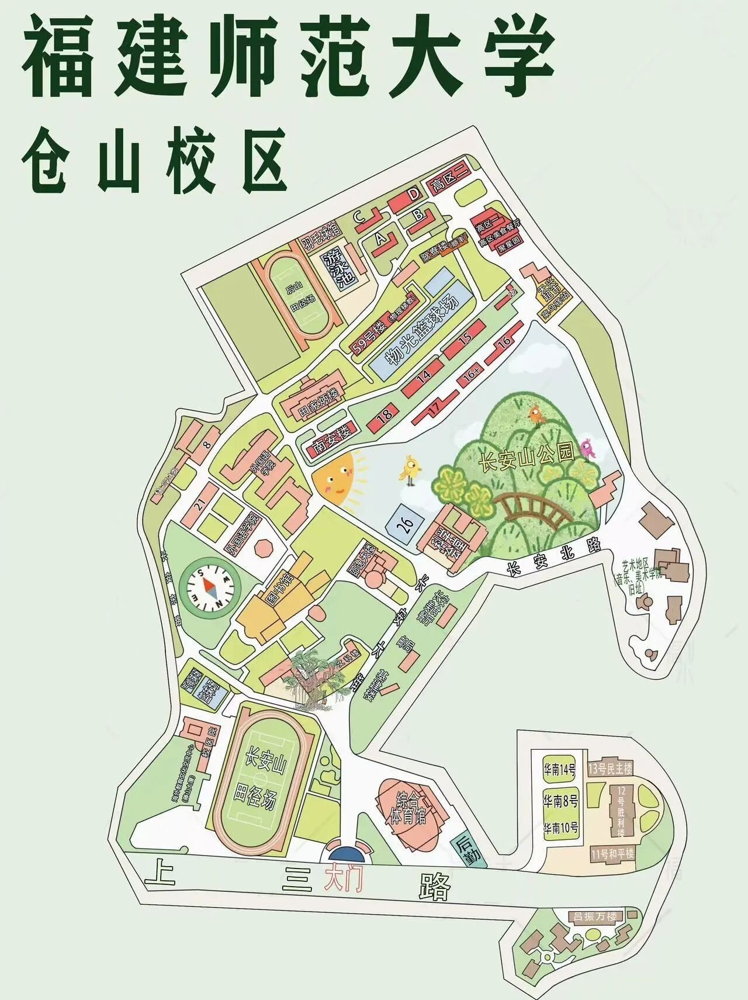
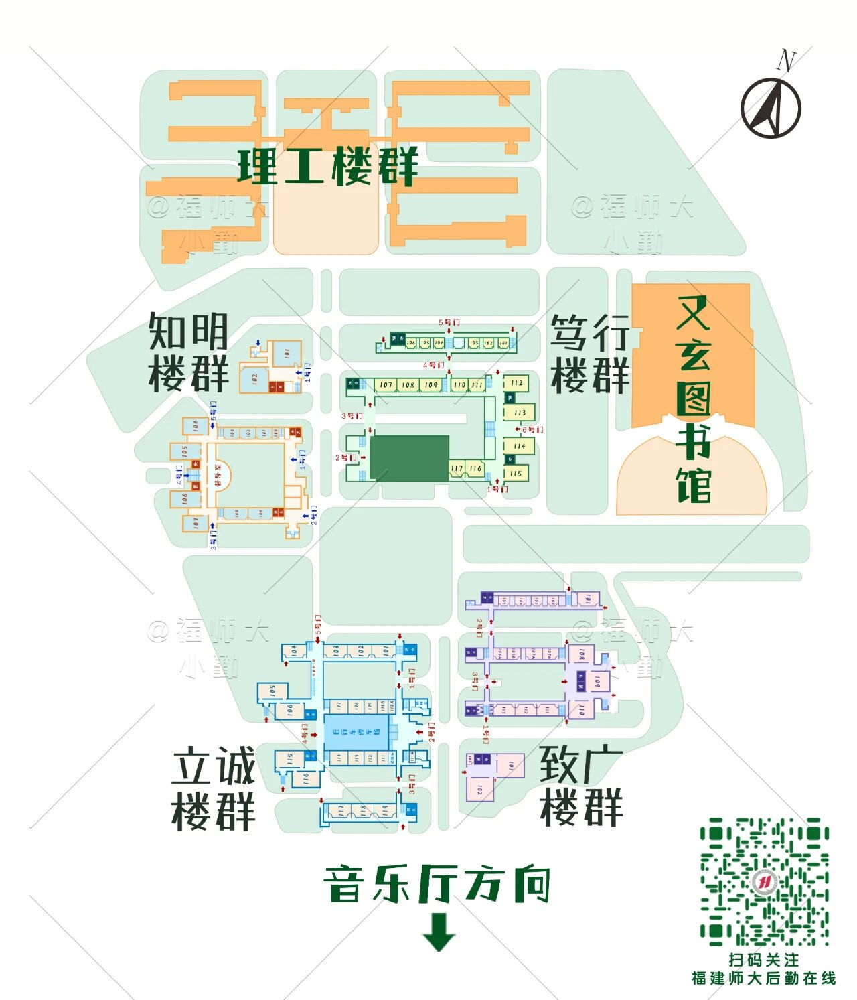
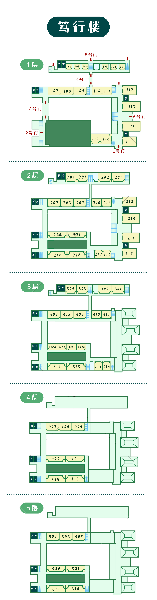
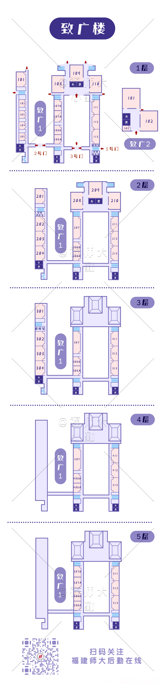
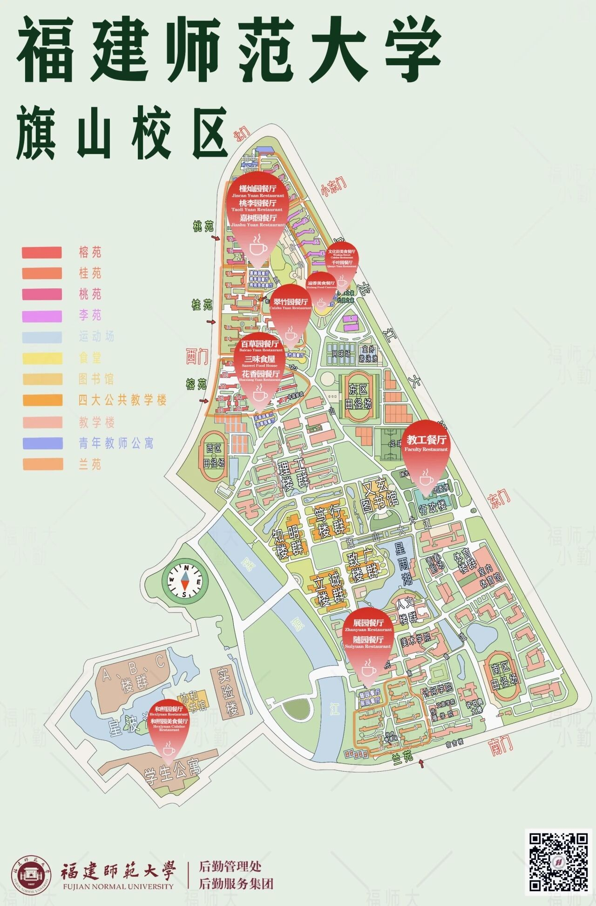
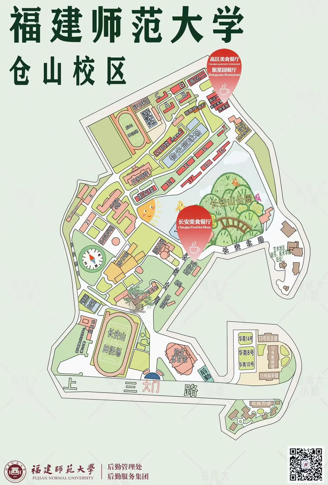

# 校园导航

校园快递站、图书馆、饮水机、游泳馆等公共设施请查看[校园设施](facilities.md)。

## 校园地图 {#campus-map}

=== "旗山校区（含河西校区）"
    

=== "仓山校区"
    

=== "旗山校区平面图"
    !!! tip "提示"
        该图片修订于 2017 年，距今已有较大差异。

    

=== "仓山校区平面图"
    

## 旗山校区教学楼分布图 {#qishan-buildings-map}

=== "教学区域分布图"
    

=== "知明楼 1"
    

=== "笃行楼"
    

=== "立诚楼"
    

=== "致广楼"
    

## 食堂分布图 {#lunchroom-map}

=== "旗山校区（含河西校区）"
    

=== "仓山校区"
    
