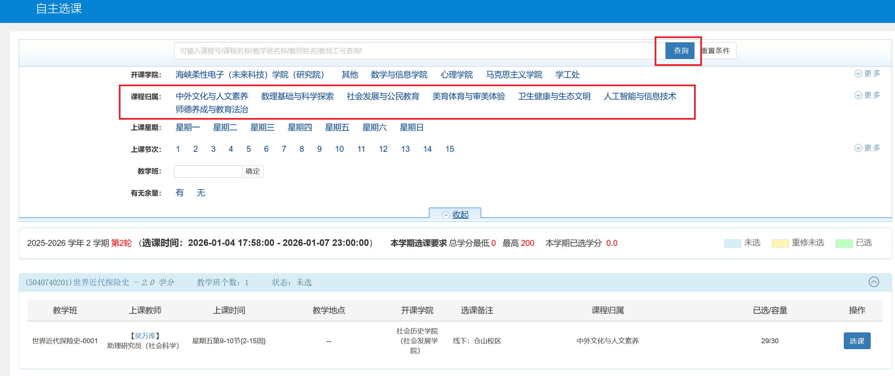

# 课程相关

## 上课时间 {#class-time}

| 时段 | 时间 | 课时 |
| --- | --- | --- |
| 上午 | 8:20-9:05、9:15-10:00 | 第 1-2 节课 |
| 上午 | 10:20-11:05、11:15-12:00 | 第 3-4 节课 |
| 下午 | 14:00-14:45、14:55-15:40 | 第 5-6 节课 |
| 下午 | 15:50-16:35、16:45-17:30 | 第 7-8 节课 |
| 晚上 | 18:30-19:15、19:25-20:10 | 第 9-10 节课 |
| 晚上 | 20:20-21:05、21:15-22:00 | 第 11-12 节课 |

大多数课程都是在连续的 2 节课上连排（如：第 1-2 节课《高等数学》、第 3-4 节课《大学物理》），部分特殊的（如部分《大学物理实验》、一学期一次的《形势与政策》）课程则可能会在连续的 4 节或 8 节课上连排。

绝大多数课程都只会在上午和下午排课，晚上原则上不排课（专业课老师若需要在晚上上课需要单独报教务处批准）。[通识教育选修课](./choose.md#elective-courses)的线下上课部分会在星期三、星期五的晚上第 9-10 节或第 11-12 节排课。

## 部分公共必修课 {#required-courses}

### 大学英语（一）\~（四） {#college-english}

本部分所介绍内容为《大学英语》课程，需要了解英语等级考试（四六级）请转[考试与成绩](./exam.md#english-tests)部分。

《大学英语》由大外部（外国语学院大学外语教学部）开设，所有学生均必修（高考选考日语的学生可以改修大学日语，见[日语高考生申请修读日语的方法](../study/exam.md#japanese-courses)）。时间跨度为第 1-4 学期，分别学习大学英语（一）\~（四）课程，每门课程 3 学分。

2024 级大学英语（三）开始采用模块选课：学术英语、国才英语、中国文化英语 三选一。具体教学实施方案见[福建师范大学《大学英语》模块课程教学实施方案（2024 年修订）](https://cfl.fjnu.edu.cn/07/11/c8474a395025/page.htm)。

#### 大学英语分班 {#english-track}

2024 级起，大学英语不再分班、英语免修规则亦同样废止。所有学生都需要学习两年的大学英语。

??? info "2023 级及以前的规则"
    根据高考英语成绩，在大一开学时分一二级班（二级是高分班），也可能会在开学后组织英语考试来进行分班。

    大学英语一共四册（八本书），一级班在每个学期末进行考试，总共需要学四个学期。二级班开学直接从第二册开始学，在第一学期多一次期中考（考第一册） ，提前一本，第一学期期末考第二册，第二学期期末考第三册，以此类推，总共需要学三个学期，比一级班少一个学期的英语课（ 2023 年批注：二级班在第二学期学完第三册、第四册，在第三学期学习口语），每年可能实施办法不同，以当年所实施的为准。

    若英语成功免修，则无论一级班还是二级班，大二的英语课都不用再上。

### 高等数学 A、B、C、D / 概率论与数理统计 / 线性代数 {#math}

《高等数学》由数学与统计学院开设，为理工商科专业（数学专业除外）必修、文科部分专业必修，课程信息如下：

| 名称 | 学分 | 面向对象 | 开设时间 |
| --- | --- | --- | --- |
| 高等数学 A（上） | 4.0 | 工科专业（毕业后授工学学士学位）必修 | 第 1 学期 |
| 高等数学 A（下） | 6.0 | 工科专业（毕业后授工学学士学位）必修 | 第 2 学期 |
| 高等数学 B（上） | 4.0 | 理科专业（毕业后授理学学士学位）必修 | 第 1 学期 |
| 高等数学 B（下） | 5.0 | 理科专业（毕业后授理学学士学位）必修 | 第 2 学期 |
| 高等数学 C（上） | 3.0 | 经济学、金融学、金融工程、工商管理类、公共管理类、旅游管理、会展经济与管理、国际经济与贸易专业必修 | 第 1 学期 |
| 高等数学 C（下） | 4.0 | 经济学、金融学、金融工程、工商管理类、公共管理类、旅游管理、会展经济与管理、国际经济与贸易专业必修 | 第 2 学期 |
| 高等数学 D | 4.0 | 小学教育、心理学类、档案学、图书馆学、文化产业管理、汉语言文学（国家人才培养基地）专业必修 | 不定 |

A\~D 使用相同的教材（同济大学数学科学学院《高等数学》），但教学内容、教学进度有所不同，通过难度大致为 A>B>C>D。

《概率论与数理统计》《线性代数》为部分专业必修，均为 3.0 学分，根据不同专业安排在第 1-4 学期排课。

以上课程的分数构成均为 总分 = 平时分 20% + 期中考 20% + 期末考 60%。

### 大学体育（一）\~（八） {#college-pe}

《大学体育》由大体部（体育科学学院大学体育教学部）开设，所有专业（体育科学相关专业除外）均必修，时间跨度为第 1-8 学期，分别学习大学体育（一）\~（八）课程，每门课程 0.5 学分。其中，大学体育（一）\~（四）为模块选课，选课时间分别为第 1 学期期初、第 1 学期期末；大学体育（五）\~（八）课程中校园跑分数占比为 100%（亦可选择线上课程进行替代）。保健班学生的《大学体育》课程以《调适体育》课程替换，详情请见[保健班](../study/physical-fitness.md#health-class)。

大学体育（四）课程中，游泳考核的部分占 20 分。游泳考核在学期末的几周课程内完成，地点为露天游泳池。考核要求：男生 50 米，女生 25 米。根据相关规定，满足以下条件之一、可以提供相关证明的可以以 1500 米跑作为替代。

- 有宗教信仰；
- 患有慢性皮肤疾病（急性不可）；
- 患有慢性中耳炎（急性不可）。

### 马工程系列课程 {#marxism-engineering}

马工程系列课程由马克思主义学院开设，所有专业均必修。

#### 思想道德与法治、马克思主义基本原理、毛泽东思想、习近平社会主义思想概论、近现代史纲要

这几门课程均为 3.0 学分的必修课，在第 1\~4 学期进行学习。每门课程均有课堂汇报部分、[青马易战](./choose.md#qingma-project)要求及统一期末考。特殊地，思想道德与法治科目无期末考、毛概及习概科目为文科专业与理工科专业分卷考核。

近几年，相关课程的期末考试考核所采用的开闭卷方式如下（开卷考试允许携带课本和手写资料，但不允许携带电子设备和打印资料）：

| 学年 | 学期 | 马原 | 毛概 | 习概 | 近代史 |
| --- | --- | --- | --- | --- | --- |
| 2025-2026 学年 | 第 1 学期 | 开卷 | / | 闭卷 | 开卷 |
| 2024-2025 学年 | 第 2 学期 | 闭卷 | 开卷 | / | 开卷 |
| 2024-2025 学年 | 第 1 学期 | 开卷 | / | 开卷 | 开卷 |
| 2023-2024 学年 | 第 2 学期 | 开卷 | 开卷 | / | 开卷 |
| 2023-2024 学年 | 第 1 学期 | 开卷 | / | 开卷 | 开卷 |
| 2022-2023 学年 | 第 2 学期 | 闭卷 | / | / | 闭卷 |
| 2022-2023 学年 | 第 1 学期 | 开卷 | / | 开卷 | 开卷 |

#### 形势与政策

本课程为 2.0 学分的必修课，在第 1\~6 学期进行学习（每个学期均有），每学期 4 学时。成绩来源于第 6 学期提交的大报告，无平时分。

### 军事理论 {#military-theory}

本课程为 3.0 学分的必修课，在第 1\~2 学期进行学习（具体哪个学期视专业培养计划安排）。有期中论文要求（可以使用 AI）和统一期末考（2024 级起，军事理论期末考试修改为开卷 + 上机考试，全部为客观题）。

### 大学生心理健康教育 {#college-mental-health}

本课程为 2.0 学分的必修课，在第 2 学期进行学习。无统一期末考，但是有形式上的期末考：在最后一节课时由教师放出试题的 PPT， 学生在限时内当场纸笔作答后上交。部分教师允许使用手机。由于题目是全校通用，而考试是在一周内分散开考，所以完全可以在考前获得题目。

[课程历年期末考题目](../tiku/college-mental-health-test.md)

## 通识教育选修课 {#elective-courses}

通识教育选修课（简称“公选课”）为课程形式之一，每位学生在校期间需修满规定学分方可毕业。

### 毕业要求 {#elective-courses-requirements}

公选课均为 2 学分/门，通过（即达到 60.0 分）即可获得相应的学分。毕业需要同时满足以下两点要求：

1. 总学分：**至少** 通过 4 门公选课（8 学分）。
2. 归属类别：每一门公选课都有相应的归属类别（见[选课界面](#choose-elective-courses)），不同专业会要求某类别至少需要通过 1 门（2 学分）或 2 门（4 学分）。通过教务系统中的【信息查询】-【学生学业情况查询】-【通识教育选修课】可以查询自己专业的具体要求。

达到以上两点要求以后便无需再进行选课。

### 选课流程 {#choose-elective-courses}

#### 选课安排

- 频率：每学期期末选下一学期的课。大学四年共 7 次选课机会。
- 限制：每学期最多选 2 门。新生第一学期不上课。

#### 选课步骤

1. 选课开始前，相关通知会在[教务处官网](https://jwc.fjnu.edu.cn)公示，同时经过各级班委下发。
2. 在通知上写明的时间内登录[教务管理系统](https://jwglxt.fjnu.edu.cn/)，在顶部依次选择【选课】-【自主选课】，即可进入选课界面。点击【查询】按钮即可获取课程列表。
3. 选择相应课程完成选课即可。每次（学期）选课最多选择 2 门课程。
4. 每次选课分为三个阶段（具体时间会在相关通知上写明）：

    - 第一阶段（线下课程、线上线下混合课程及部分线上课程）：无限制，在选课结束后会对超过容量上限的课程随机踢人，优先踢低年级学生。
    - 第二阶段（线上课程、第一阶段未选满课程）：先到先得。课程达到容量上限后不再允许被选择。最终未满 20 人的课程一般不开课，选择此类课程的学生可以参与补选。
    - 第三阶段（第二阶段未选满课程）：先到先得。

    在第一阶段、第二阶段中，可以随时对同阶段内的选课进行退课，点击选课界面右侧的“选课信息”即可查看课程和退课。第三阶段不允许退课。

5. 每一阶段结束后，可以根据相应通知时间（不是阶段结束后立即可查）查询自己是否选上相关课程。查询方式：福Star APP - 顶部搜索“个人信息查询” - 【选课信息】，若列表中有你选择的课程则确认选上。

### 课程类型 {elective-courses-type}

公选课分为线上课、线下课、线上+线下混合课。

- 线上课：纯在线教学，通过中国大学MOOC、学习通、智慧树等平台进行。在指定时间内完成课程要求的视频、测验、考试等即可。（注：智慧树平台的公选课需要加入教学班才计入成绩，相关信息会在平台上进行公告）
- 线上+线下混合课：大部分在线教学，通过中国大学MOOC、学习通、智慧树等平台进行，穿插几次线下教学，一般无线下期末考试。（注：智慧树平台的公选课需要加入教学班才计入成绩，相关信息会在线下课程时由教师公布）
- 线下课：纯线下教学，可能有线下期末考试。

| 类型 | 教学形式 | 考核方式 | 备注 |
| --- | --- | --- | --- |
| 线上课 | 纯网课（MOOC/学习通/智慧树等平台） | 线上视频 + 测验 + 期末考 | 智慧树平台的公选课需要加入教学班才计入成绩，相关信息会在平台上进行公告 |
| 混合课 | 线上网课 + 少量线下课 | 同上，一般不进行线下考勤 | 智慧树平台的公选课需要加入教学班才计入成绩，相关信息会在线下课上由老师宣布 |
| 线下课 | 纯线下教学 | 考勤（部分有） + 期末考试 | 只会在周三或周五晚上上课，不会与已有课程冲突 |

### 补充提示 {elective-courses-extraction}

1. 选课规则：公选课允许选择自己学院的课程，允许（但不建议）跨校区选课。
2. 成绩影响：公选课不设置补缓考，总评满 60 分即可拿到对应的学分，分数不影响学分绩点（GPA），但是会显示在成绩单上。
3. 评优评先：**自 2024-2025 学年起，公选课被纳入评优评先的参考因素之一，挂科（未达到 60 分）直接影响当年评优评先**。
4. 转专业影响：若转专业成功，旧专业修读过但新专业无需修读的课程的学分会相应转化为公选课学分（不属于任何课程类别）。
5. 成绩作废：若公选课为 0 分，可以申请成绩作废，这样这门课的成绩就不会显示在成绩单上。需要自行咨询学院教学秘书。

## 教材的购买 {#textbook-purchase}

大一上学期的教材由学校统一预定，必须交钱购买。此后的教材建议自行购买（通过学校购买价格很贵，而且很多书实际上根本没用），但部分学院[马工程系列课程](#marxism-engineering)的教材依然为强制统一订购（更没用了）。

教材可以通过向学长学姐收购或在网上购买的方式获取。市场价一般是 5~10 块钱一本，非常良心。

## 个性化培养周 {#customized-program}

个性化培养周是 ~~学校深化本科人才培养模式改革、推动本科教育内涵发展的重要举措，聚焦培养学生的全面发展，设置以多样性、立体化的课程内容供学生自主选修，突出学生在跨学院、跨学科、跨专业课程中的个性发展，实现第一大课堂、第二课堂、社会课堂、云上课堂四环联动，切实打破学院壁垒、学科壁垒，为学生打造多元化成才道路~~ 学校馈赠的两周假期。

简而言之，个性化培养周是一学年内挑一段时间停课两周，在个性化培养周开始前进行选课（选课规则同通识教育选修课），然后在这两周内只需要上满自己已选的课程门数，其余时间即可放假。每一级在四年期间只上两次个性化培养周（例如：2025 级在 2025-2026 学年没有上个性化培养周，则安排在 2026-2027 学年和 2027-2028 学年完成）。

| 学年 | 时间 | 面向对象 | 课程门数要求 | 其它 |
| --- | --- | --- | --- | --- |
| 2025-2026 学年 | 第 1 学期第 10-11 周 | 2023 级、2024 级 | 4+2 门校级线下课程 + 3 门院级线下课程 + 4 门线上课程 | 二维码签到 |
| 2024-2025 学年 | 第 2 学期第 7-8 周 | 2022 级、2023 级、2024 级 | 8 门线下课程 + 4 门线上课程 | 二维码/数字码签到 + 签退，签退时需要提交不少于 30 字课程评价，计网学院在所有课程结束后需要提交不少于 1000 字的大报告 |
| 2023-2024 学年 | 第 1 学期第 10-11 周 | 2021 级 | 6 门线下课程 + 4 门线上课程 | 数字码签到 |
| 2022-2023 学年 | 第 2 学期第 20-21 周 | 2020 级、2021 级、2022 级 | 5 门线下课程 + 5 门线上课程 | 数字码签到 |
| 2021-2022 学年 | 第 1 学期第 10-11 周 | 2019 级、2020 级 | 5 门线下课程 + 5 门线上课程 | 数字码签到 |

## 青马易战 {#qingma-project}

青马易战为马工程课程的考核形式之一，作为分数组成的一部分。需要学生在规定时间内通过【易班 APP - 青马易战】内完成对应科目的练习题，达到指定要求后计算分数。一般而言，500 题正确题数 且 总正确率达到 60% 为相应模块满分。

### 综测加分 {#qingma-comprehensive-bonus}

青马易战会对各位的答题情况进行数据统计，每个月会发放通报，对本月各学院所得积分最高的同学给予奖状奖励，相关奖状在当年综测加分时可计算为 1 分文体分；每个学期会发放通报，对本学期各学院所得积分最高的同学给予奖状奖励，相关奖状在当年综测加分时可计算为 2 分文体分（聊胜于无）。

### 逃课技巧 {#qingma-helper}

GitHub 有相关项目，请自行了解（使用第三方工具有被封号、通报等的风险，请知悉）。

初级的，安卓手机可使用夸克悬浮窗进行迅速手动搜答案完成答题，相较纯脚本逃课耗时较多但风险极低，可自行在小红书等平台搜索教程，简单易上手。
